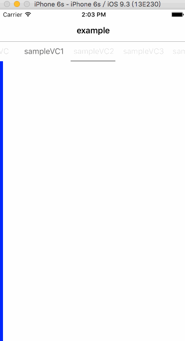

# ContainerViewController

[](https://travis-ci.org/JiangTeng/ContainerViewController)
[](http://cocoapods.org/pods/ContainerViewController)
[](http://cocoapods.org/pods/ContainerViewController)
[](http://cocoapods.org/pods/ContainerViewController)

## About
With the swift implementation ContainerViewController.

#### [YSLContainerViewController](https://github.com/y-hryk/YSLContainerViewController)

## Example

To run the example project, clone the repo, and run `pod install` from the Example directory first.



## Requirements
* Xcode 7.3+
* iOS 8.0+
* Swift 2.2+

## Installation

ContainerViewController is available through [CocoaPods](http://cocoapods.org). To install
it, simply add the following line to your Podfile:

```ruby
pod "ContainerViewController"
```

## Usage
        
        let sampleVC1:UIViewController = UIViewController()
        sampleVC1.title = "sampleVC1"
        sampleVC1.view.backgroundColor = UIColor.blueColor()
        
        let sampleVC2:UIViewController = UIViewController()
        sampleVC2.title = "sampleVC2"
        
        let sampleVC3:UIViewController = UIViewController()
        sampleVC3.title = "sampleVC3"
        sampleVC3.view.backgroundColor = UIColor.redColor()
        
        let sampleVC4:UIViewController = UIViewController()
        sampleVC4.title = "sampleVC4"
                
        // ContainerView
        let statusHeight:CGFloat = UIApplication.sharedApplication().statusBarFrame.height
        let navigationHeight:CGFloat = (self.navigationController?.navigationBar.frame.height)!
        
        
        let contaninerVC = TNContainerViewController.init(controllers: [playListVC,artistVC,sampleVC1,sampleVC2,sampleVC3,sampleVC4,sampleVC5], topBarHeight: statusHeight + navigationHeight, parentViewController: self)
        contaninerVC.menuItemFont = UIFont.systemFontOfSize(16)
        contaninerVC.delegate = self
		contaninerVC.menuIndicatorColor = UIColor.redColor()
        contaninerVC.menuItemTitleColor = UIColor.purpleColor()
        contaninerVC.menuItemSelectedTitleColor = UIColor.yellowColor()        		
        self.view.addSubview(contaninerVC.view)

## Property
        contaninerVC.menuItemFont = UIFont.systemFontOfSize(16)
		contaninerVC.menuIndicatorColor = UIColor.redColor()
        contaninerVC.menuItemTitleColor = UIColor.purpleColor()
        contaninerVC.menuItemSelectedTitleColor = UIColor.yellowColor() 
        
## To Do


## Author

JiangTeng, teng.jiang@dianping.com

## License

ContainerViewController is available under the MIT license. See the LICENSE file for more info.
    
## Licence
MIT
